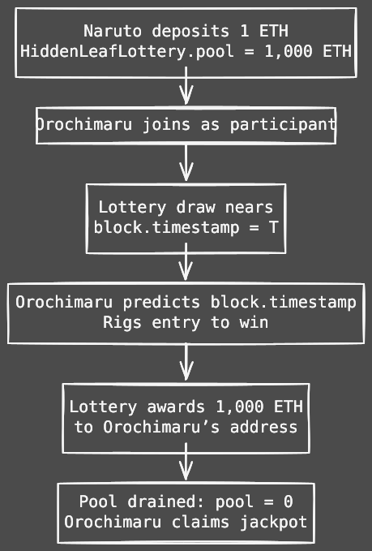

# Naruto vs The Chaos Scroll: Insecure Randomness Catastrophe

## Why Randomness Fails: A Quick Overview
Yo, shinobi of the DeFi world! You’re forging legendary protocols, but using predictable randomness like `block.timestamp` in lotteries or games is like leaving a sacred scroll open for Orochimaru to exploit. Attackers can rig outcomes, drain funds, and shatter trust in your Hidden Village. This case study uncovers how insecure randomness gets exploited ? dattebayo!

## TL;DR
 **Vulnerability**: Using `block.timestamp` for randomness lets attackers predict or manipulate lottery outcomes.  
 **Impact**: Funds are stolen, and fairness is destroyed, undermining protocol trust.  
 **Fix**: Use blockhash limits, Chainlink VRF, or commit-reveal schemes for secure randomness.  
 **Key Lesson**: Insecure randomness is like handing Orochimaru the Chaos Scroll—he’ll twist fate to his will!
 ---

 Check out the live version [live here](https://www.thesandf.com/posts/mcs/insecure-randomness/?ref=github).

## 🎬 Story Time: The Chaos Scroll Heist
Naruto Uzumaki, a loyal ninja, joins the **HiddenLeafLottery**, a smart contract promising 1,000 ETH to a randomly chosen winner based on `block.timestamp`. Orochimaru, a cunning rogue ninja, exploits the predictable randomness to ensure his entry wins the jackpot. By the time Naruto checks the results, Orochimaru has vanished with the prize, leaving the Hidden Leaf Village’s trust in tatters.

## Roles / Actors
| Actor | Role |
|:---|:---|
| **HiddenLeafLottery (Vulnerable)** | Smart contract managing a lottery with `block.timestamp`-based randomness. |
| **Naruto (User)** | Honest ninja depositing funds to participate. |
| **Orochimaru (Attacker)** | Rogue ninja manipulating randomness to steal the prize. |
| **ETH Pool** | Prize pool of 1,000 ETH for the winner. |

*Note*: The case study uses ETH for simplicity. Real-world lotteries often use WETH or ERC20 tokens for compatibility.

## Vulnerable Code: HiddenLeafLottery.sol
This lottery contract uses `block.timestamp` for randomness, making it vulnerable to manipulation.

```solidity
// SPDX-License-License: MIT
pragma solidity ^0.8.30;

// Vulnerable lottery contract
contract HiddenLeafLottery {
    // --- Vulnerabilities ---
    // 1. Insecure Randomness: block.timestamp is predictable and miner-influenced.
    // 2. No Reentrancy Protection: Risks multiple withdrawals.
    // 3. Unchecked ETH Transfer: Risks failure if winner is a contract.
    // 4. No State Validation: Allows draw manipulation.

    address public hokage;
    uint256 public entryFee = 1 ether;
    uint256 public pool = 0;
    address[] public ninjas;
    bool public drawCompleted = false;

    constructor() {
        hokage = msg.sender;
    }

    function enter() external payable {
        require(msg.value == entryFee, "Incorrect entry fee");
        ninjas.push(msg.sender);
        pool += msg.value;
    }

    function drawWinner() external {
        require(msg.sender == hokage, "Only hokage");
        require(!drawCompleted, "Draw already completed");
        require(ninjas.length > 0, "No ninjas");

        // Vulnerable: Uses block.timestamp for randomness
        uint256 random = uint256(keccak256(abi.encodePacked(block.timestamp, ninjas.length)));
        uint256 winnerIndex = random % ninjas.length;
        address winner = ninjas[winnerIndex];

        drawCompleted = true;
        (bool success, ) = winner.call{value: pool}("");
        require(success, "Transfer failed");
        pool = 0;
    }

    function getPoolBalance() external view returns (uint256) {
        return pool;
    }
}
```

**Vulnerabilities**:
1. **Insecure Randomness**: `block.timestamp` is predictable and manipulable by miners within a ~15-second window on Ethereum.
2. **No Reentrancy Protection**: Risks multiple withdrawals if the winner is a malicious contract.
3. **Unchecked ETH Transfer**: Fails if the winner is a contract without a `receive` function.
4. **No State Validation**: Lacks strict draw timing, enabling manipulation.

## Attack Steps
1. **Naruto Enters**: Deposits 1 ETH, adding to `pool = 1,000 ETH` and `ninjas` array.
2. **Orochimaru Joins**: Enters the lottery and analyzes `block.timestamp` patterns.
3. **Draw Approaches**: The hokage calls `drawWinner` at `block.timestamp = T`.
4. **Orochimaru Manipulates**: Predicts `block.timestamp` or mines a block to influence the random number (`random % ninjas.length`), ensuring his address wins.
5. **Funds Drained**: The contract transfers 1,000 ETH to Orochimaru, setting `pool = 0`.
6. **Outcome**: Orochimaru escapes with the jackpot, leaving Naruto and the village betrayed.

## Attack Flow:
This Mermaid flowchart illustrates Orochimaru’s randomness manipulation exploit:



*Clarification*: Miners can adjust `block.timestamp` within ~15 seconds on Ethereum (shorter on networks like Polygon’s ~2-second block times), and its predictability allows attackers to rig randomness.

## Proof of Exploit: Foundry Test
This Foundry test simulates Orochimaru’s randomness manipulation.

```solidity
// SPDX-License-License: MIT
pragma solidity ^0.8.30;

import "forge-std/Test.sol";
import "../../src/Insecure-Randomness/HiddenLeafLottery.sol";

contract HiddenLeafLotteryTest is Test {
    HiddenLeafLottery lottery;
    address naruto = makeAddr("Naruto");
    address orochimaru = makeAddr("Orochimaru");
    address hokage = makeAddr("Hokage");

    function setUp() public {
        vm.prank(hokage);
        lottery = new HiddenLeafLottery();
        vm.deal(naruto, 1 ether);
        vm.deal(orochimaru, 1 ether);

        // Naruto enters
        vm.prank(naruto);
        lottery.enter{value: 1 ether}();
    }

    function testRandomnessExploit() public {
        // Step 1: Orochimaru enters
        vm.prank(orochimaru);
        lottery.enter{value: 1 ether}();

        // Step 2: Orochimaru manipulates timestamp
        uint256 targetTimestamp = block.timestamp;
        uint256 position = 2;
        while (true) {
            uint256 random = uint256(keccak256(abi.encodePacked(targetTimestamp, position)));
            uint256 winnerIndex = random % position;
            if (winnerIndex == 1) break; // Orochimaru is second ninja
            targetTimestamp++;
        }
        vm.warp(targetTimestamp);

        // Step 3: Hokage triggers draw
        vm.prank(hokage);
        lottery.drawWinner();

        // Step 4: Verify Orochimaru won
        assertEq(orochimaru.balance, 2 ether, "Orochimaru did not win jackpot");
        assertEq(lottery.getPoolBalance(), 0, "Pool not drained");
    }
}
```

*Note*: The test uses `vm.warp` to simulate timestamp manipulation. On Ethereum mainnet, attackers can predict or influence `block.timestamp` within ~15 seconds.

## Fixes: Securing the HiddenLeafLottery

### Fix 1: Blockhash Limits
This fix uses `blockhash` of a specific block to reduce predictability, with stricter state checks.

```solidity
// SPDX-License-License: MIT
pragma solidity ^0.8.30;

import "@openzeppelin/contracts/security/ReentrancyGuard.sol";
import "@openzeppelin/contracts/access/Ownable.sol";

contract HiddenLeafLotteryBlockhash is ReentrancyGuard, Ownable {
    address public hokage;
    uint256 public entryFee = 1 ether;
    uint256 public drawBlock;
    uint256 public pool = 0;
    address[] public ninjas;
    bool public drawCompleted = false;

    constructor() Ownable(msg.sender) {
        hokage = msg.sender;
    }

    function enter() external payable nonReentrant {
        require(msg.value == entryFee, "Incorrect entry fee");
        ninjas.push(msg.sender);
        pool += msg.value;
    }

    function setDrawBlock() external onlyOwner {
        require(drawBlock == 0, "Draw block already set");
        drawBlock = block.number + 1; // Use next block’s hash
    }

    function drawWinner() external nonReentrant onlyOwner {
        require(drawBlock > 0, "Draw block not set");
        require(block.number > drawBlock, "Wait for draw block");
        require(!drawCompleted, "Draw already completed");
        require(ninjas.length > 0, "No ninjas");

        bytes32 blockHash = blockhash(drawBlock);
        require(blockHash != bytes32(0), "Blockhash unavailable");
        uint256 random = uint256(keccak256(abi.encodePacked(blockHash, ninjas.length)));
        uint256 winnerIndex = random % ninjas.length;
        address payable winner = payable(ninjas[winnerIndex]);

        drawCompleted = true;
        pool = 0;
        (bool success, ) = winner.call{value: address(this).balance}("");
        require(success, "Transfer failed");
    }

    function getPoolBalance() external view returns (uint256) {
        return pool;
    }
}
```

*Improvements*:
- Uses `blockhash` of a predetermined block (`drawBlock`) to limit miner influence.
- Adds `nonReentrant` to prevent reentrancy attacks.
- Updates state before transfer to avoid multiple withdrawals.

*Note*: Miners can still influence `blockhash` if they mine `drawBlock`, but the window is narrower than `block.timestamp`. Test with [Hardhat/OpenZeppelin Upgrades Plugins](https://docs.openzeppelin.com/upgrades-plugins) to simulate edge cases.

### Fix 2: Chainlink VRF
This uses Chainlink VRF for cryptographically secure randomness.

```solidity
// SPDX-License-Identifier: MIT
pragma solidity ^0.8.30;

import "@openzeppelin/contracts/security/ReentrancyGuard.sol";
import "@openzeppelin/contracts/access/Ownable.sol";
import "@chainlink/contracts/src/v0.8/interfaces/VRFCoordinatorV2_5Interface.sol";
import "@chainlink/contracts/src/v0.8/VRFConsumerBaseV2_5.sol";

contract HiddenLeafLotteryVRF is VRFConsumerBaseV2_5, ReentrancyGuard, Ownable {
    VRFCoordinatorV2_5Interface COORDINATOR;
    address public hokage;
    uint256 public entryFee = 1 ether;
    uint256 public pool = 0;
    address[] public ninjas;
    bool public drawCompleted = false;
    uint256 public requestId;
    uint64 public subscriptionId;
    

    address vrfCoordinator = 0x103B0745b564009bb3c6d0cce433e59bbf5b34f823bc56cbbf5b34f823bc56cf9758f5df; // Example address
    bytes32 keyHash = 0xb3c6d0cce433e59bbf5b34f823bc56c96d3c009b2b3c6d0cce433e59bbf5b34f823bc56c; // Example keyHash
    uint32 callbackGasLimit = 100000;
    uint16 requestConfirmations = 3;
    uint32 numWords = 1;

    constructor(uint64 _subscriptionId) VRFConsumerBaseV2_5(vrfCoordinator) Ownable(msg.sender) {
        hokage = msg.sender;
        COORDINATOR = VRFCoordinatorV2_5Interface(vrfCoordinator);
        subscriptionId = _subscriptionId;
    }

    function enter() external payable nonReentrant {
        require(msg.value == entryFee, "Incorrect entry fee");
        ninjas.push(msg.sender);
        pool += msg.value;
    }

    function requestRandomWinner() external onlyOwner {
        require(!drawCompleted, "Draw already completed");
        require(ninjas.length > 0, "No ninjas");
        requestId = COORDINATOR.requestRandomness(
            keyHash,
            subscriptionId,
            requestConfirmations,
            callbackGasLimit,
            numWords
        );
    }

    function fulfillRandomness(uint256 _requestId, uint256[] calldata randomWords) internal override {
        require(!drawCompleted, "Draw already completed");
        uint256 winnerIndex = randomWords[0] % ninjas.length;
        address payable winner = payable(ninjas[winnerIndex]);

        drawCompleted = true;
        pool = 0;
        (bool success, ) = winner.call{value: address(this).balance}("");
        require(success, "Transfer failed");
    }

    function getPoolBalance() external view returns (uint256) {
        return pool;
    }
}
```

*Improvements*:
- Uses Chainlink VRF for cryptographically secure randomness, immune to miner manipulation.
- Includes `nonReentrant` and state updates before transfer.

*Note*: Requires a Chainlink subscription and LINK tokens, adding costs (~0.1-1 LINK per request). Test integrations with [Hardhat/OpenZeppelin Upgrades Plugins](https://docs.openzeppelin.com/upgrades-plugins). See [Chainlink VRF v2.5 subscription setup guide](https://docs.chain.link/vrf) for configuration.

### Fix 3: Commit-Reveal Scheme
This uses a commit-reveal scheme for secure randomness without external oracles.

```solidity
// SPDX-License-License: MIT
pragma solidity ^0.8.30;

import "@openzeppelin/contracts/security/ReentrancyGuard.sol";
import "@openzeppelin/contracts/access/Ownable.sol";

contract HiddenLeafLotteryCommitReveal is ReentrancyGuard, Ownable {
    address public hokage;
    uint256 public entryFee = 1 ether;
    uint256 public commitDeadline;
    uint256 public revealDeadline;
    uint256 public pool = 0;
    address[] public ninjas;
    mapping(address => bytes32) public commitments;
    mapping(address => uint256) public revealedSecrets;
    bool public drawCompleted = false;

    constructor(uint256 _commitDeadline, uint256 _revealDeadline) Ownable(msg.sender) {
        hokage = msg.sender;
        commitDeadline = _commitDeadline;
        revealDeadline = _revealDeadline;
    }

    function commit(bytes32 commitment) external payable nonReentrant {
        require(block.timestamp < commitDeadline, "Commit phase closed");
        require(msg.value == entryFee, "Incorrect entry fee");
        require(commitments[msg.sender] == bytes32(0), "Already committed");
        commitments[msg.sender] = commitment;
        ninjas.push(msg.sender);
        pool += msg.value;
    }

    function reveal(uint256 secret) external nonReentrant {
        require(block.timestamp >= commitDeadline, "Commit phase not ended");
        require(block.timestamp < revealDeadline, "Reveal phase closed");
        require(commitments[msg.sender] != bytes32(0), "No commitment");
        require(keccak256(abi.encodePacked(secret, msg.sender)) == commitments[msg.sender], "Invalid secret");
        revealedSecrets[msg.sender] = secret;
    }

    function drawWinner() external nonReentrant onlyOwner {
        require(block.timestamp >= revealDeadline, "Reveal phase not ended");
        require(!drawCompleted, "Draw already completed");
        require(ninjas.length > 0, "No ninjas");

        uint256 random = 0;
        for (uint256 i = 0; i < ninjas.length; i++) {
            require(revealedSecrets[ninjas[i]] != 0, "Not all secrets revealed");
            random ^= revealedSecrets[ninjas[i]];
        }
        uint256 winnerIndex = random % ninjas.length;
        address payable winner = payable(ninjas[winnerIndex]);

        drawCompleted = true;
        pool = 0;
        (bool success, ) = winner.call{value: address(this).balance}("");
        require(success, "Transfer failed");
    }

    function getPoolBalance() external view returns (uint256) {
        return pool;
    }
}
```

*Improvements*:
- Uses commit-reveal to generate randomness from user-submitted secrets, preventing miner manipulation.
- Includes `nonReentrant` and state updates before transfer.

*Trade-offs*:
- **Complexity**: Requires two-phase user interaction (commit and reveal), which may deter participation.
- **Cost**: Higher gas costs due to multiple transactions (commit: ~50K gas, reveal: ~30K gas).
- **Alternatives**: Verifiable Delay Functions (VDFs) offer provably secure randomness with computational delays (e.g., Ethereum’s RANDAO+VDF). Beacon chains (Ethereum 2.0) provide miner-resistant randomness.

*Note*: Requires clear user instructions to ensure timely reveals. Test with [Hardhat/OpenZeppelin Upgrades Plugins](https://docs.openzeppelin.com/upgrades-plugins) to simulate user behavior and edge cases. See [OpenZeppelin’s commit-reveal implementation](https://github.com/OpenZeppelin/openzeppelin-contracts/blob/master/contracts/examples/RandomNumberConsumer.sol) and [Solidity by Example’s commit-reveal implementation](https://github.com/solidity-by-example/randomness/blob/master/CommitReveal.sol) for reference.

## Randomness and Governance Risks
Insecure randomness undermines fairness:
- **Miner Manipulation**: Miners can influence `block.timestamp` or `blockhash` within ~15 seconds on Ethereum.
- **User Collusion**: In commit-reveal, users may collude to bias outcomes.
- **Recommendation**: Use Chainlink VRF for simplicity or commit-reveal for cost-effectiveness. Test integrations with [Foundry/OpenZeppelin Upgrades Plugins](https://docs.openzeppelin.com/upgrades-plugins) to simulate network variability (e.g., Ethereum’s ~15-second blocks vs. Polygon’s ~2-second blocks). Refer to [OpenZeppelin’s documentation](https://docs.openzeppelin.com/upgrades) and [community forums](https://forum.openzeppelin.com) for best practices. TheSandF ensures robust randomness audits.

## Real-World Context & Referance
Insecure randomness has caused major losses. The 2018 Fomo3D hack exploited predictable block-based randomness, draining ~$2M in ETH. A 2020 governance attack manipulated random seeds to skew voting outcomes. This case study mirrors such exploits:

| Hack | Vulnerability | Loss | Lesson |
|------|---------------|------|--------|
| **Fomo3D (2018)** | Predictable block-based randomness | ~$2M | Use secure randomness sources |
| **Governance Attack (2020)** | Manipulable random seed | Variable | Implement commit-reveal or VRF |
| **HiddenLeafLottery (Fictional)** | Timestamp-based randomness | 1,000 ETH | Adopt Chainlink VRF or commit-reveal |

## Auditor’s Checklist
- [ ] **Secure Randomness Source**: Avoid `block.timestamp` or `blockhash` alone; implement Chainlink VRF ([setup guide](https://docs.chain.link/vrf/v2/subscription)), commit-reveal ([OpenZeppelin example](https://github.com/OpenZeppelin/openzeppelin-contracts/blob/master/contracts/examples/RandomNumberConsumer.sol), [Solidity by Example](https://github.com/solidity-by-example/randomness/blob/master/CommitReveal.sol)), or advanced patterns like VDFs or Ethereum 2.0 beacon chains.
- [ ] **Reentrancy Protection**: Apply `nonReentrant` modifier for external calls to prevent multiple withdrawals.
- [ ] **State Management**: Update critical state (e.g., `pool`, `drawCompleted`) before transfers to avoid double-spending.
- [ ] **Timelocks for Admin Actions**: Enforce delays (e.g., 48 hours) for admin-triggered draws to allow community review.
- [ ] **Integration Testing**: Test randomness implementations with [Hardhat/OpenZeppelin Upgrades Plugins](https://docs.openzeppelin.com/upgrades-plugins), simulating edge cases (e.g., missed reveal deadlines, miner manipulation, network-specific block times like Ethereum’s ~15 seconds or Polygon’s ~2 seconds).
- [ ] **Gas Optimization**: Minimize gas costs, especially for commit-reveal (~80K gas total), by optimizing storage and loops.
- [ ] **User Collusion Mitigation**: In commit-reveal, enforce strict deadlines and aggregate multiple secrets to reduce collusion risks.
- [ ] **Fallback Mechanisms**: Implement fallback randomness (e.g., admin-generated seed) if Chainlink VRF or commit-reveal fails, with strict access controls.
- [ ] **Network Compatibility**: Verify randomness behavior across networks (e.g., Ethereum, Polygon, BNB Chain) to account for block time differences.
- [ ] **Documentation and Community**: Follow best practices from [OpenZeppelin docs](https://docs.openzeppelin.com/upgrades), [community forums](https://forum.openzeppelin.com), [Chainlink VRF setup guide](https://docs.chain.link/vrf).

---

## Challenge: The Chaos Scroll Lottery

**Challenge Name**: Naruto’s Fight Against Insecure Randomness
**Description**: Help Naruto stop Orochimaru from manipulating the **HiddenLeafLottery**! The contract uses `block.timestamp` for randomness, leaving the Chaos Scroll unsealed. Your task is to reproduce the exploit, then seal the scroll by fixing the randomness source.

1. Deploy `HiddenLeafLottery.sol` on a local chain (Foundry Anvil or Remix).
2. Simulate Orochimaru’s attack by predicting/manipulating `block.timestamp` using Foundry tests (`HiddenLeafLotteryTest.t.sol`).
3. Prove the exploit by draining the 1,000 ETH pool to Orochimaru’s address.
4. Fix the contract by:

   * Using `blockhash` of a future block (`HiddenLeafLotteryBlockhash.sol`) **OR**
   * Integrating Chainlink VRF (`HiddenLeafLotteryVRF.sol`) **OR**
   * Implementing a commit–reveal scheme (`HiddenLeafLotteryCommitReveal.sol`).
5. Re-run your test to confirm Orochimaru’s exploit fails, ensuring Naruto protects the Hidden Leaf Village’s trust.
6. Share your fix and deployed contract address on X with `#TheSandFChallenge` and tag `@THE_SANDF`.

**Bonus**: Post a screenshot of your failed exploit test (`testRandomnessExploit`) or successful VRF fulfillment!

**Reward**: Top ninjas earn a spot in our audit beta program and eternal glory in the Hall of Heroes 🏆

---

## 🎯 Three Quiz Questions to Test Understanding

1. **Why is `block.timestamp` unsafe for randomness in lotteries like HiddenLeafLottery?**

a) It always produces the same value across blocks
b) Miners can manipulate it slightly to influence outcomes
c) It requires more gas than Chainlink VRF
d) It isn’t compatible with Solidity 0.8.x

<details>
<summary>Show Answer</summary>  

**Answer**: b) Miners can manipulate it slightly to influence outcomes
**Explanation**: On Ethereum, miners can adjust `block.timestamp` within ~15 seconds. This small leeway is enough for an attacker like Orochimaru to skew lottery results in their favor.

</details>  

---

2. **Which method provides the most secure source of randomness among the following?**

a) `block.timestamp`
b) `blockhash(block.number - 1)`
c) Chainlink VRF
d) `abi.encodePacked(block.difficulty, msg.sender)`

<details>
<summary>Show Answer</summary>  

**Answer**: c) Chainlink VRF
**Explanation**: Chainlink VRF generates randomness off-chain and proves it cryptographically on-chain, preventing miner or user manipulation. Block-based values remain predictable and unsafe.

</details>  

---

3. **What’s a limitation of the commit–reveal randomness scheme compared to Chainlink VRF?**

a) It cannot generate randomness
b) It requires multiple phases and user participation
c) It always leaks the secret before reveal
d) It costs more gas than Chainlink VRF

<details>
<summary>Show Answer</summary>  

**Answer**: b) It requires multiple phases and user participation
**Explanation**: Commit–reveal is secure and cost-effective but adds complexity: users must commit their secret and later reveal it within deadlines. Failure to reveal can stall the process.

</details>  

---

## Ready to Battle Bugs? 

**Join** the **Defi CTF Challenge!** Audit vulnerable contracts in our Defi CTF Challenges (Full credit to [Hans Friese](https://x.com/hansfriese), co-founder of [Cyfrin](https://cyfrin.com).), submit your report via GitHub Issues/Discussions, or tag @THE_SANDF on X. Let’s secure the Web3 multiverse together!  🏗️ [Start the Challenge](https://www.thesandf.com/posts/ctf-solutions/defi-ctf-challenges/)


### All Files Available here.

::github{repo="thesandf/thesandf.com"}