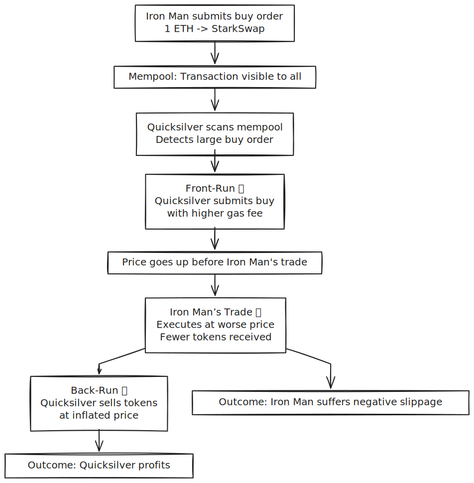

# Quicksilver vs. Iron Man – Outrunning the Sandwich Attack (MEV) in Solidity 🥪

## TL;DR: Maximal Extractable Value (MEV)
- **Vulnerability**: **Ethereum's Mempool** exposes pending transactions, enabling attackers to **reorder** them for profit via **Sandwich Attacks**.  
- **Impact**: Victims (e.g., traders) receive fewer tokens due to **negative slippage**, while attackers extract **near risk-free profit** (MEV).  
- **Fixes**: **Commit–Reveal Schemes**, **Batch Auctions**, and **Private Transaction Relays (Flashbots)** with strict **Slippage Protection**.
---
Check out the live version of the website [live here](https://www.thesandf.xyz/posts/mcs/reentrancy-cei/?ref=github).

## 🎬 Story Time
In the bustling DeFi hub of Stark City, **Iron Man (Tony Stark)** fires up his HUD, submitting a massive buy order to **StarkSwap**, a decentralized exchange (DEX). His transaction, glowing with 1 ETH, lands in the **Mempool**-Ethereum’s public queue, visible to all. **JARVIS** warns of prying eyes, but it’s too late. **Quicksilver**, a lightning-fast MEV bot, scans the mempool with predatory precision. Spotting Iron Man’s trade, Quicksilver predicts a price spike and launches a **three-step sandwich attack**:  

1. **Front-Run (First Slice 🍞)**: Quicksilver submits a small buy with a **higher gas fee**, executing just before Iron Man’s trade, inflating the token price.  
2. **Iron Man’s Trade (The Filling 🥩)**: Stark’s order executes at the **worse price**, yielding fewer tokens due to **negative slippage**.  
3. **Back-Run (Second Slice 🍞)**: Quicksilver sells at the artificially high price, pocketing risk-free profit.



Quicksilver’s speed outpaces Iron Man’s tech, draining value in a flash. Can Stark and JARVIS outsmart this MEV heist? 

### Actors / Roles 

| Actor	        | Role                               |
| --------------|------------------------------------|
| Quicksilver	| Attacker (Front-runs and Back-runs)|
| Iron Man	    | Victim (Suffers price manipulation)|
| StarkSwap	    | Vulnerable DEX                     |

### All Files Available here.
### All Files Available here.
::github{repo="thesandf/thesandf.xyz"}


##  Vulnerable Pattern: `StarkSwap.sol`
The vulnerability lies in the **public exposure** of trade intent (`msg.value`) in the mempool, allowing precise price manipulation.

> **Note**: Simplified AMM for demonstration; real DEXs include fees, liquidity pools, etc.

```solidity
// SPDX-License-Identifier: MIT
pragma solidity ^0.8.24;

contract StarkSwap {
    mapping(address => uint256) public balances;
    uint256 public reserveETH = 1000 ether;
    uint256 public reserveToken = 10000 ether;

    function buy(uint256 minTokens) public payable {
        uint256 tokensOut = (msg.value * reserveToken) / (reserveETH + msg.value);
        require(tokensOut >= minTokens, "Slippage too high");
        reserveETH += msg.value;
        reserveToken -= tokensOut;
        balances[msg.sender] += tokensOut;
        // 🛑 Vulnerability: msg.value visible in mempool
    }

    function sell(uint256 tokenAmount, uint256 minEth) public returns (uint256 ethOut) {
        ethOut = (tokenAmount * reserveETH) / (reserveToken + tokenAmount);
        require(ethOut >= minEth, "Slippage too high");
        require(balances[msg.sender] >= tokenAmount, "Not enough tokens");
        balances[msg.sender] -= tokenAmount;
        reserveToken += tokenAmount;
        reserveETH -= ethOut;
        payable(msg.sender).transfer(ethOut);
        return ethOut;
    }
}
```

## Proof of Exploit: Foundry Simulation (The Full Sandwich)
This Foundry test simulates Quicksilver’s attack, showing Iron Man’s loss and the attacker’s profit.

```solidity
// SPDX-License-Identifier: MIT
pragma solidity ^0.8.24;

import "forge-std/Test.sol";
import {StarkSwap} from "../../src/Multiverse-Case-Studies/Sandwich-MEV/StarkSwap.sol";

contract StarkSwapTest is Test {
    StarkSwap dex;
    address IronMan = makeAddr("IronMan");
    address Quicksilver = makeAddr("Quicksilver");

    function setUp() public {
        dex = new StarkSwap();
        vm.deal(IronMan, 10 ether);
        vm.deal(Quicksilver, 10 ether);
    }

    function testSandwichAttack() public {
        // STEP 1: Front-Run
        vm.prank(Quicksilver);
        dex.buy{value: 1 ether}(10);
        uint256 Q_tokens_acquired = dex.balances(Quicksilver);

        // STEP 2: Victim's Trade
        vm.prank(IronMan);
        dex.buy{value: 1 ether}(10);

        // STEP 3: Back-Run
        vm.prank(Quicksilver);
        uint256 Q_eth_revenue = dex.sell(Q_tokens_acquired, 0);

        // Check: Iron Man’s Loss
        assertLt(dex.balances(IronMan), 95 ether, "Iron Man received fewer tokens");
        // Check: Quicksilver’s Profit
        uint256 Q_cost = 1 ether;
        uint256 netProfit = Q_eth_revenue - Q_cost;
        console.log("Q's ETH Cost (Front-Run):", Q_cost);
        console.log("Q's ETH Revenue (Back-Run):", Q_eth_revenue);
        console.log("Quicksilver's Net Profit (MEV):", netProfit);
        assertGt(netProfit, 0, "Quicksilver failed to profit");
    }
}
```

**Logs**:  
- Q's ETH Cost (Front-Run): 1000000000000000000  
- Q's ETH Revenue (Back-Run): 1001998000003992007  
- Quicksilver's Net Profit (MEV): 1998000003992007

## Professional Defense Mechanisms
#### 1. Commit–Reveal Scheme
Hides trade details until execution.

```solidity
// SPDX-License-Identifier: MIT
pragma solidity ^0.8.24;

contract StarkSwapCommitReveal {
    mapping(address => uint256) public balances;
    mapping(address => bytes32) public commitments;
    uint256 public reserveETH = 1000 ether;
    uint256 public reserveToken = 10000 ether;

    // Step 1: Commit hash
    function commit(bytes32 hash) public {
        commitments[msg.sender] = hash;
    }

    // Step 2: Reveal trade
    function reveal(uint256 ethAmount, uint256 nonce, uint256 minTokens) public payable {
        bytes32 hash = keccak256(abi.encodePacked(msg.sender, ethAmount, nonce));
        require(commitments[msg.sender] == hash, "Invalid reveal");
        require(msg.value == ethAmount, "Incorrect ETH");
        uint256 tokensOut = (ethAmount * reserveToken) / (reserveETH + ethAmount);
        require(tokensOut >= minTokens, "Slippage too high");
        reserveETH += ethAmount;
        reserveToken -= tokensOut;
        balances[msg.sender] += tokensOut;
        commitments[msg.sender] = bytes32(0);
    }
}
```

**MEV Prevention**: Hides trade details via a hash, preventing Quicksilver’s front-run.

#### 2. Batch Auctions
Groups trades for a uniform clearing price.

```solidity
// Add to StarkSwap.sol or new contract
function batchBuy(uint256 minTokens, address[] memory users, uint256[] memory amounts) public payable {
    require(users.length == amounts.length, "Invalid input");
    uint256 totalETH;
    uint256 totalTokens;

    // Calculate total token allocation
    for (uint256 i = 0; i < users.length; i++) {
        totalETH += amounts[i];
        uint256 tokensOut = (amounts[i] * reserveToken) / (reserveETH + totalETH);
        require(tokensOut >= minTokens, "Slippage too high");
        totalTokens += tokensOut;
    }

    // Update reserves
    reserveETH += totalETH;
    reserveToken -= totalTokens;

    // Allocate tokens
    for (uint Ascending | Descending) {
        balances[users[i]] += (amounts[i] * totalTokens) / totalETH;
    }
}
```

**MEV Prevention**: Uniform pricing neutralizes reordering advantages.

#### 3. Private Transaction Relays (Flashbots)
- **Mechanism**: Send transactions privately to block builders, bypassing the public mempool.  
- **MEV Prevention**: Quicksilver can’t see Iron Man’s trade to front-run it.

### Auditor’s Checklist
- [ ] **Slippage Enforcement**: Use minimal slippage (e.g., 0.5%) to limit MEV profit.  
- [ ] **Transaction Obfuscation**: Verify Commit–Reveal or Batch Auctions hide trade details.  
- [ ] **Test Coverage**: Simulate front-run/back-run in unit tests to ensure resilience.  
- [ ] **Gas Fee Awareness**: Minimize gas-based front-running vectors.  
- [ ] **MEV Monitoring**: Track on-chain ordering patterns for anomalies.


## Gamified Challenge: Outrun Quicksilver’s Sandwich Attack!
**Challenge Name**: Stark’s MEV Defense Mission  
**Description**: Outsmart Quicksilver like Iron Man and JARVIS! Secure StarkSwap from sandwich attacks!  
1. Deploy `StarkSwap.sol` on Sepolia testnet (use Remix or Foundry).  
2. Execute the sandwich attack using the provided Foundry test to see Iron Man’s losses.  
3. Implement a fix (e.g., `StarkSwapCommitReveal.sol` or `batchBuy` with 0.5% slippage).  
4. Fork [sol-bug-bench](https://github.com/hans-cyfrin/sol-bug-bench), submit your fix to the Discussions tab, and share your Sepolia address on X with `#TheSandFChallenge` and `@THE_SANDF`.  
5. **Bonus**: Post a screenshot of JARVIS’s transaction logs!  
6. Top submissions earn a shoutout on TheSandF.xyz’s X account and a chance to join our audit beta program!

## Quiz Time
1. **What makes StarkSwap.sol vulnerable to a sandwich attack?**  
   a) Lack of access control in `buy()`  
   b) Public exposure of trade details in the mempool  
   c) Missing reentrancy protection in `sell()`  
   d) Incorrect reserve calculations in the AMM  
   **Answer**: b) Public exposure of trade details in the mempool  
   **Explanation**: Mempool visibility lets Quicksilver front-run Iron Man’s trade, rigging the price.  

2. **Which fix prevents Quicksilver’s sandwich attack?**  
   a) Adding `nonReentrant` to `buy()`  
   b) Using Commit–Reveal to hide trade details  
   c) Increasing reserveToken balance  
   d) Requiring multi-signature validation  
   **Answer**: b) Using Commit–Reveal to hide trade details  
   **Explanation**: Commit–Reveal obscures trade details, blocking front-running.  

3. **What is the primary impact of a sandwich attack on Iron Man’s trade?**  
   a) Higher gas fees  
   b) Fewer tokens due to negative slippage  
   c) Direct ETH theft by Quicksilver  
   d) Drained DEX reserves  
   **Answer**: b) Fewer tokens due to negative slippage  
   **Explanation**: Quicksilver’s front-run raises the price, reducing Iron Man’s tokens.

### All Files Available here.
### All Files Available here.
::github{repo="thesandf/thesandf.xyz"}